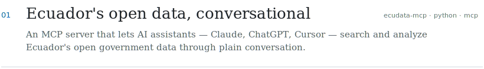
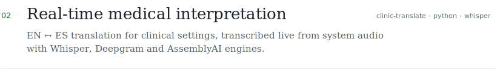
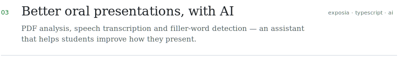
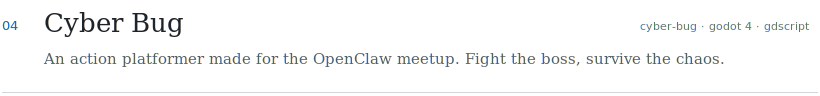
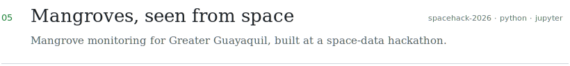
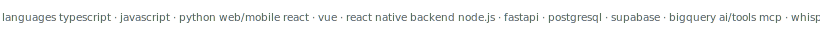

<picture>
  <source media="(prefers-color-scheme: dark)" srcset="./assets/header-dark.svg">
  
</picture>

 

SELECTED WORKS

<a href="https://github.com/DweskZ/EcuDataMCP">
  <picture>
    <source media="(prefers-color-scheme: dark)" srcset="./assets/works-01-dark.svg">
    
  </picture>
</a>

<a href="https://github.com/DweskZ/InterpreterMedicalTranslation">
  <picture>
    <source media="(prefers-color-scheme: dark)" srcset="./assets/works-02-dark.svg">
    
  </picture>
</a>

<a href="https://github.com/DweskZ/ExposiaClean">
  <picture>
    <source media="(prefers-color-scheme: dark)" srcset="./assets/works-03-dark.svg">
    
  </picture>
</a>

<a href="https://github.com/DweskZ/Cyber-Bug-Videogame">
  <picture>
    <source media="(prefers-color-scheme: dark)" srcset="./assets/works-04-dark.svg">
    
  </picture>
</a>

<a href="https://github.com/DweskZ/Spacehack2026">
  <picture>
    <source media="(prefers-color-scheme: dark)" srcset="./assets/works-05-dark.svg">
    
  </picture>
</a>

<a href="https://github.com/DweskZ?tab=repositories">all repositories →</a>

STACK

<picture>
  <source media="(prefers-color-scheme: dark)" srcset="./assets/stack-dark.svg">
  
</picture>

ACTIVITY

  

 

  

