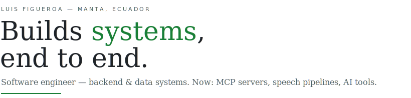
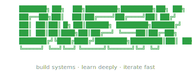

<picture>
  <source media="(prefers-color-scheme: dark)" srcset="./assets/header-dark.svg">
  
</picture>

 

SELECTED WORKS

### 01 — Ecuador's open data, conversational

[**ecudata-mcp**](https://github.com/DweskZ/EcuDataMCP) · python · mcp

An MCP server that lets AI assistants — Claude, ChatGPT, Cursor — search and analyze Ecuador's open government data through plain conversation.

---

### 02 — Real-time medical interpretation

[**clinic-translate**](https://github.com/DweskZ/InterpreterMedicalTranslation) · python · whisper

EN ↔ ES translation for clinical settings, transcribed live from system audio with Whisper, Deepgram and AssemblyAI engines.

---

### 03 — Better oral presentations, with AI

[**exposia**](https://github.com/DweskZ/ExposiaClean) · typescript · ai

PDF analysis, speech transcription and filler-word detection — an assistant that helps students improve how they present.

---

### 04 — Cyber Bug

[**cyber-bug**](https://github.com/DweskZ/Cyber-Bug-Videogame) · godot 4 · gdscript

An action platformer made for the OpenClaw meetup. Fight the boss, survive the chaos.

---

### 05 — Mangroves, seen from space

[**spacehack-2026**](https://github.com/DweskZ/Spacehack2026) · python · jupyter

Mangrove monitoring for Greater Guayaquil, built at a space-data hackathon.

<a href="https://github.com/DweskZ?tab=repositories">all repositories →</a>

---

STACK

*typescript · javascript · python* &nbsp;—&nbsp; *react · vue · react native* &nbsp;—&nbsp; *node.js · fastapi · postgresql · supabase · bigquery* &nbsp;—&nbsp; *mcp · whisper · docker · gcp · godot*

ACTIVITY

  

---

  

